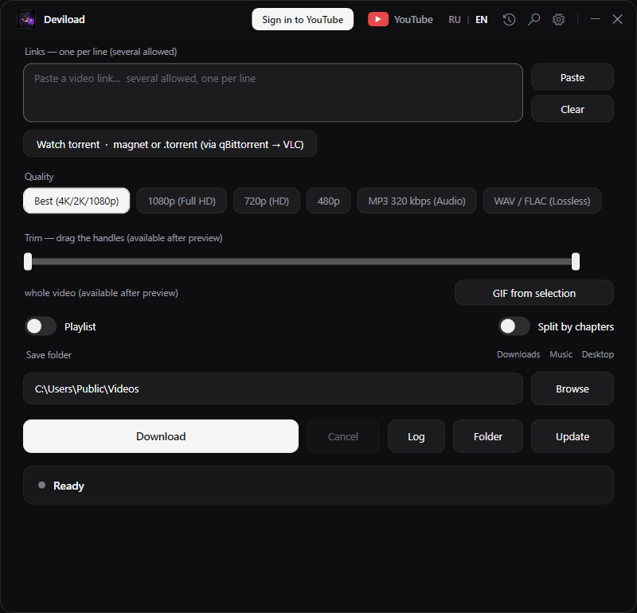

# Deviload

[](https://github.com/Pronexsteam/deviload/actions/workflows/check.yml) [](https://github.com/Pronexsteam/deviload/releases) [](https://github.com/Pronexsteam/deviload/releases/latest)

A small Windows desktop front-end for [yt-dlp](https://github.com/yt-dlp/yt-dlp). Paste a link, pick a quality, press Download. Playlists, chapters, trimming, GIFs, MP3/FLAC extraction, subtitles, SponsorBlock, a one-click YouTube sign-in — in one portable folder, no installer. Interface in English and Russian.



Full guide with screenshots: [docs/guide-en.md](docs/guide-en.md) · Русская версия: [docs/guide-ru.md](docs/guide-ru.md)

## Install

1. Download `Deviload-portable.zip` from Releases.
2. Unzip anywhere. Keep the folder together — the app looks for `yt-dlp.exe`, `ffmpeg.exe` and the WebView2 DLLs next to `Deviload.exe`.
3. Run `Deviload.exe`. Nothing is installed; settings and history stay in the folder.

The **Update** button tracks the yt-dlp *nightly* channel: YouTube changes weekly and the stable yt-dlp release lags behind, so the app reminds you once a day when its yt-dlp is older than two weeks (nothing is downloaded until you press the button).

Requirements: Windows 10/11 with the WebView2 Runtime (part of Windows 11 and of Windows 10 with Edge).

## Sign in to YouTube

Private and members-only videos and the "Sign in to confirm you're not a bot" refusal need a signed-in account (age-restricted videos too, but since mid-2026 YouTube may additionally require age verification on the account itself — that part is outside any downloader's control). Press **Sign in to YouTube** in the title bar, log into Google in the window that opens, done: Deviload saves the session to `cookies.txt` next to the app and passes it to yt-dlp automatically. The account glyph that replaces the button signs you out again (deletes `cookies.txt` and the `wv2-profile` browser profile). `cookies.txt` is your account — never share it. Details: [guide, "Sign in to YouTube"](docs/guide-en.md#sign-in-to-youtube).

## Build from source

The app is a single Windows PowerShell 5.1 script, `YT-Downloader.ps1` (WPF). Binaries are not in the repository.

```
git clone <this repo>
setup.bat            # downloads yt-dlp, ffmpeg, deno, WebView2 SDK DLLs next to the script
Deviload.vbs         # run the script (no console window)
build.bat            # ps2exe -> Deviload.exe, Deviload-portable\ and Deviload-portable.zip
```

Releases are built by GitHub Actions: pushing a tag `vX.Y.Z` runs `setup.ps1` + `build.ps1` on a Windows runner and attaches `Deviload-portable.zip` to the release.

`setup-torrent.bat` installs the optional torrent engine (needs Node.js).

## Licenses

- **Deviload** — MIT, © 2026 Samvel Avetisyan ([LICENSE](LICENSE)).
- **yt-dlp** — [Unlicense](https://github.com/yt-dlp/yt-dlp/blob/master/LICENSE) (public domain).
- **FFmpeg** (`ffmpeg.exe`, `ffprobe.exe`) — LGPL v2.1+ with GPL v3 components; the shipped build is the [BtbN/FFmpeg-Builds](https://github.com/BtbN/FFmpeg-Builds) `win64-gpl` static build, GPL v3 (source at [github.com/FFmpeg/FFmpeg](https://github.com/FFmpeg/FFmpeg)). FFmpeg is a trademark of Fabrice Bellard.
- **Deno** — [MIT](https://github.com/denoland/deno/blob/main/LICENSE.md).
- **Microsoft Edge WebView2 SDK** — Microsoft Software License Terms, obtained through `setup-webview2.bat` from [NuGet](https://www.nuget.org/packages/Microsoft.Web.WebView2).
- **ps2exe** (host stub inside `Deviload.exe`) — [Microsoft Limited Public License](https://github.com/MScholtes/PS2EXE/blob/master/LICENSE).

The binaries are shipped only in the Releases zip, together with their licence texts in `LICENSES/`; the repository contains only the source and the setup scripts that fetch them.

## Для русскоязычных

Deviload — портативная оболочка для yt-dlp: вставил ссылку, выбрал качество, нажал «Скачать». Интерфейс переключается на русский кнопкой `RU` в заголовке окна. Установка: скачать `Deviload-portable.zip` из Releases, распаковать, запустить `Deviload.exe`. Кнопка **Войти в YouTube** решает проблемы с приватными видео, 18+ и проверкой «не робот». Подробное руководство со скриншотами — [docs/guide-ru.md](docs/guide-ru.md).
