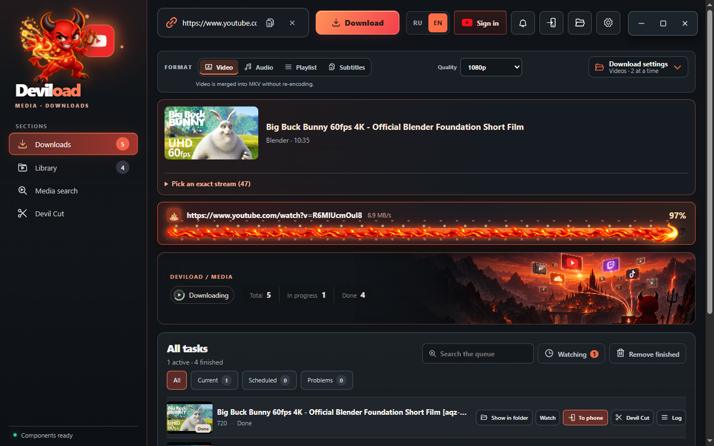
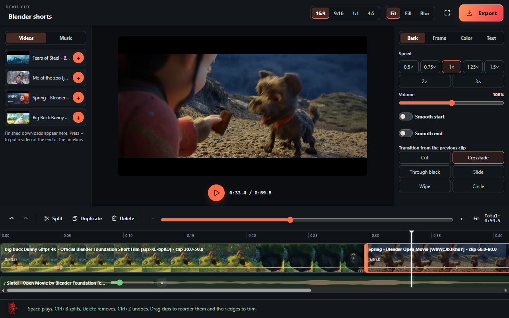
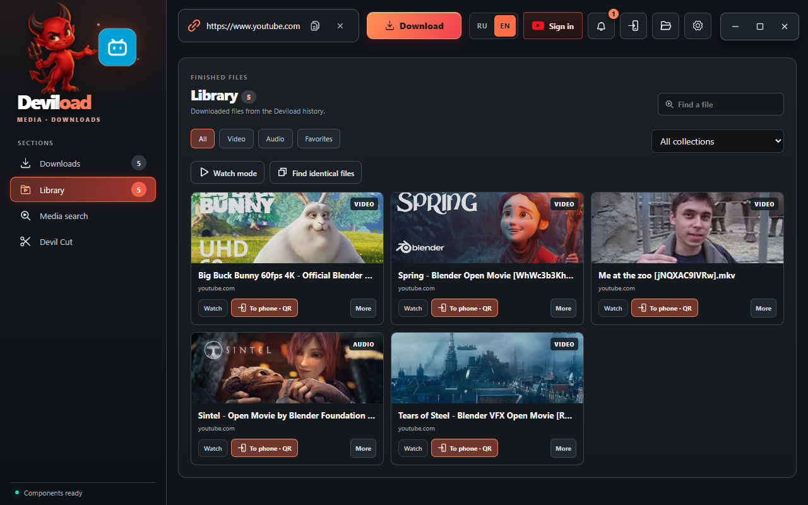
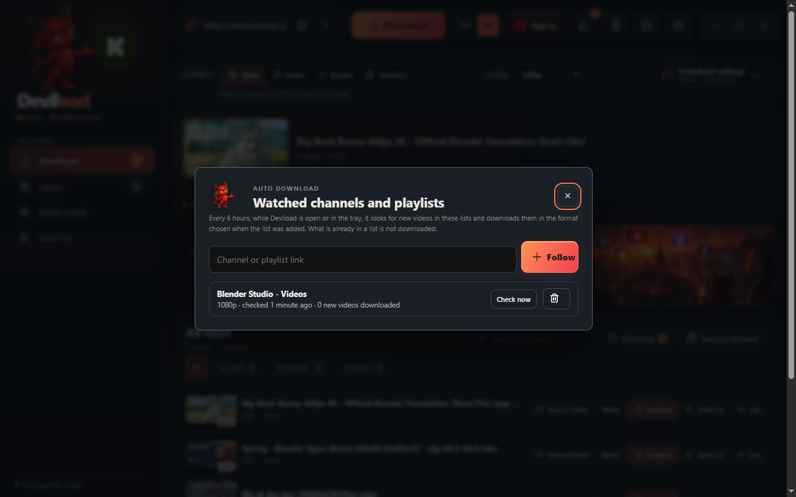
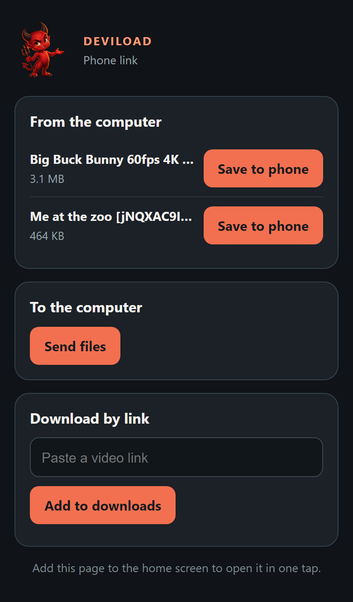

# Deviload

[](https://github.com/Pronexsteam/deviload/releases/latest)
[](https://github.com/Pronexsteam/deviload/releases)
[](https://github.com/Pronexsteam/deviload/actions/workflows/ci.yml)

**[Download Deviload for Windows](https://github.com/Pronexsteam/deviload/releases/latest)**: take `Deviload-<version>-setup.exe` from the latest release.



Desktop app for downloading video and music with [yt-dlp](https://github.com/yt-dlp/yt-dlp), built with Rust and [Tauri 2](https://tauri.app). Windows is the main target; macOS builds come from CI and have not been tested on a real Mac yet. The interface is available in English and Russian and switches instantly with the RU / EN toggle in the top bar.

## Features

- **Downloads** from YouTube, YouTube Music and every other site yt-dlp supports. Best, 1080p, 720p or 480p video; MP3, FLAC or WAV audio. Profiles for music, archive, phone (MP4) and maximum quality.
- **One link field.** Paste one or more links, or drop a link from the browser anywhere on the window. A preview with the title, duration and the real streams of the source appears by itself; an exact stream can be picked.
- **Playlists**: whole list, first N items or exact ranges, a track picker by title, and splitting by chapters. Subtitles, SponsorBlock removal and a per-format download archive.
- **Watched channels and playlists**: new videos in a followed list download by themselves, in the format picked when the list was added. Lists are checked every 6 hours while Deviload runs, including from the tray.
- **Queue** with 1 to 8 parallel downloads, pause, resume, reorder, delayed start, automatic retry of temporary network errors, a per-task log and readable error hints. The queue survives restarts; interrupted tasks resume only when you ask.
- **Readable errors** with a fix button: sign in for age-restricted, private or members-only videos, update yt-dlp when YouTube changes its protection.
- **Pre-flight check** before adding: engines present, save folder writable, free disk space, links already downloaded.
- **Library** of finished files with favorites, collections, tags, search, a duplicate finder and a built-in player that remembers the position and shows chapters and subtitles.
- **Devil Cut**, a video editor in its own window, in the spirit of CapCut:
  - media from your downloads on the left, a live preview in the middle, clip settings on the right, a timeline with a music track below;
  - split at the playhead, delete, duplicate, drag to reorder, drag edges to trim, undo and redo, zoom down to single frames, full screen;
  - transitions between clips (crossfade, through black, slide, wipe, circle) and a sound wave on the tracks;
  - per clip: speed 0.5× to 3×, volume, smooth start and end, rotation, mirror, brightness, contrast, saturation and a caption;
  - frame formats 16:9, 9:16, 1:1 and 4:5 with fit, fill or a blurred background; export to MP4 (1080p, 720p, 480p), GIF or MP3 with progress;
  - projects are saved automatically, and source files are never changed.
- **Audio tools** for MP3, FLAC and WAV: tags and loudness normalization, saved as a new copy.
- **Phone link** over the local network: one QR code opens a page on the phone that downloads the files you send from Deviload, sends photos and videos back to the computer (each one needs your OK), and adds links to the download queue. The link turns off after 30 minutes without the phone, and the page can be added to the phone's home screen.
- **Search** YouTube and YouTube Music inside the app.
- **YouTube sign-in in one step**: press Sign in, log in to Google in the window that opens, and Deviload keeps the session for downloads. Firefox cookies or your own `cookies.txt` also work (and Chrome, Edge, Brave or Safari on macOS).
- **Updates**: Deviload checks GitHub once a day and updates itself in one click (the portable zip points to the releases page); yt-dlp updates itself to the nightly build once a day when nothing is downloading. Both can be turned off in the settings.
- **Proxy** for downloads, search, link checks and yt-dlp updates (HTTP, HTTPS, SOCKS4 and SOCKS5).
- **Moving from Deviload 1.x**: the history, settings and the list of downloaded videos of the old portable version move over in one click; cookies are not copied.
- Tray mode and start with Windows, OS notifications, clipboard link suggestions, links from a text file, a copyable yt-dlp command in every task log, keyboard shortcuts (Ctrl/⌘+L links, Ctrl/⌘+K queue search, Ctrl/⌘+Enter download, Escape closes dialogs) and a short guided tour. Only one copy of Deviload runs at a time; starting it again brings the open window forward.

## Screenshots

| Devil Cut | Library |
|---|---|
|  |  |
| **Watched channels** | **Phone link** |
|  |  |

## Install on Windows

Download `Deviload-<version>-setup.exe` from the releases page and run it. It installs for the current user, adds a Start menu shortcut and brings yt-dlp, FFmpeg and Deno along. Later versions install from inside the app. A portable zip is published next to it.

## Requirements

Deviload runs yt-dlp, FFmpeg, FFprobe and Deno as separate processes. It looks for them next to the executable, in a `bin` folder next to it, and in `PATH` (plus `/opt/homebrew/bin` and `/usr/local/bin` on macOS). Windows also needs the Microsoft Edge WebView2 Runtime, which Windows 10 and 11 normally include.

## Build from source (Windows)

You need Node.js 22 or newer, Rust with the MSVC toolchain and Visual Studio Build Tools with the C++ workload and a Windows SDK.

```powershell
npm ci
powershell -ExecutionPolicy Bypass -File scripts\fetch-tools.ps1   # yt-dlp, FFmpeg, FFprobe, Deno into .\bin
npm run tauri dev                                                  # run in development mode
powershell -ExecutionPolicy Bypass -File scripts\package.ps1      # installer, portable zip and latest.json in .\dist
```

`scripts\package.ps1` builds the release, copies the installer to `dist\Deviload-<version>-setup.exe`, writes the update feed `dist\latest.json` and assembles a portable `dist\Deviload\` folder (`Deviload.exe`, the engines in `bin\`, the licence texts) zipped as `dist\Deviload-<version>-windows-x64-portable.zip`.

In-app updates are signed. The script reads the private key and its password from `TAURI_SIGNING_PRIVATE_KEY` and `TAURI_SIGNING_PRIVATE_KEY_PASSWORD`, or from a key file with a `.password` file next to it: `DEVILOAD_UPDATER_KEY`, then `keys\deviload-updater.key` (the `keys` folder is ignored by git), then `%USERPROFILE%\.tauri\deviload-updater.key`. The matching public key is in `src-tauri/tauri.conf.json`; a build signed with any other key cannot update existing installs.

## Releases

Pushing a tag that matches the version, for example `v2.0.0`, runs `.github/workflows/release.yml`: GitHub builds and tests the app and publishes the installer, the portable zip and `latest.json` as the latest release. The repository needs two secrets: `TAURI_SIGNING_PRIVATE_KEY` (the content of the key file) and `TAURI_SIGNING_PRIVATE_KEY_PASSWORD`. Installed copies find the new version through `releases/latest/download/latest.json`. The same run adds an unsigned macOS test build, `Deviload-<version>-macos-test.zip`, which needs `brew install yt-dlp ffmpeg deno` and, because it is not notarized, `xattr -cr Deviload.app` before the first start.

## Build from source (macOS)

Untested on real hardware so far. Install the Xcode Command Line Tools, Rust and Node.js, then:

```sh
brew install yt-dlp ffmpeg deno
npm ci
npm run tauri dev
npm run tauri build -- --bundles app,dmg
```

Public macOS builds would also need a Developer ID signature and notarization.

## Data and privacy

The queue (`queue.json`), per-format download archives and the saved YouTube sign-in (`youtube-cookies.txt`) live in the app data folder: `%APPDATA%\com.deviload.desktop` on Windows, `~/Library/Application Support/com.deviload.desktop` on macOS. The sign-in export keeps only YouTube and Google cookies and never leaves your computer. Library tags, collections, player positions, Devil Cut projects and the proxy are stored in `library.json`, watched lists in `watches.json` and the phone link key in `phone.json`, all in the same folder. Files received from a phone go to `Deviload from phone` inside the download folder.

Deviload has no telemetry. Besides the sites you download from, it contacts GitHub to check for a new Deviload and to update yt-dlp; both checks can be turned off in the settings. The phone link only listens on the local network address and only while it is on; every file a phone sends needs your confirmation.

Engines run with an argument list and no shell. A task counts as finished only when yt-dlp exits with code 0, and the queue file is written atomically.

## Tests

```sh
npm run check
npm test
cargo test --manifest-path src-tauri/Cargo.toml --locked
cargo test --manifest-path src-tauri/Cargo.toml --locked -- --include-ignored   # also runs FFmpeg/yt-dlp integration tests
```

The integration tests generate their own media and serve it from a local HTTP server, so they need the engines but no network. `npm test` also checks that every interface string has a Russian translation. The integration tests also render Devil Cut projects with transitions, music, captions, GIF and MP3 output through FFmpeg.

## Translations

English is the source language. Russian strings live in `src/locales/ru.js`, keyed by the English text. Messages from the Rust core are English and are translated in the interface, including messages that carry runtime values (`"Search failed: {detail}"`).

## Licence

Deviload is MIT licensed (see `LICENSE`). The Windows installer and the portable build ship yt-dlp (Unlicense), FFmpeg (GPL v3 build) and Deno (MIT); see `LICENSES/README.txt` for details and the other bundled components.
