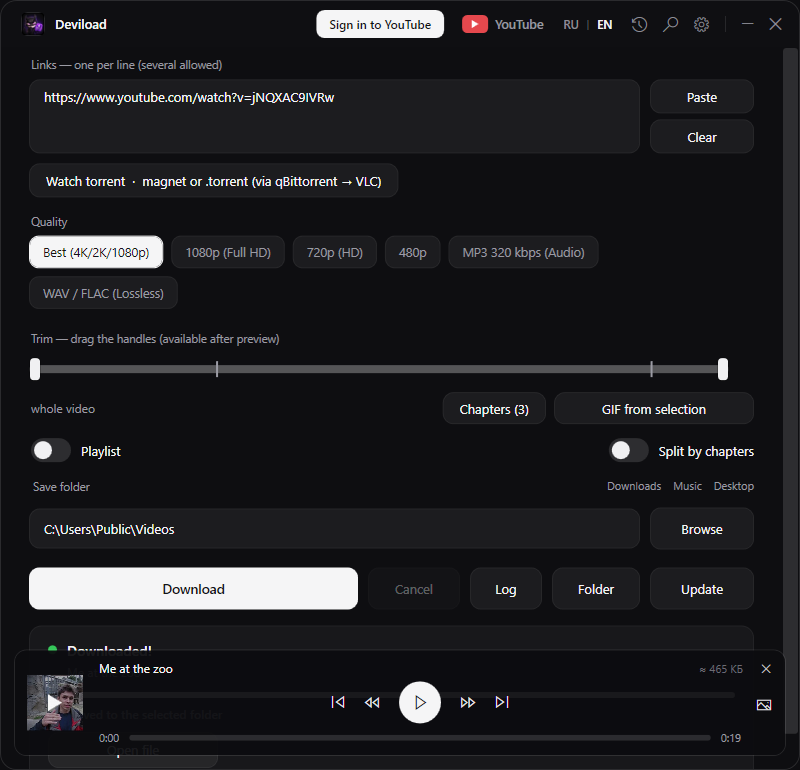
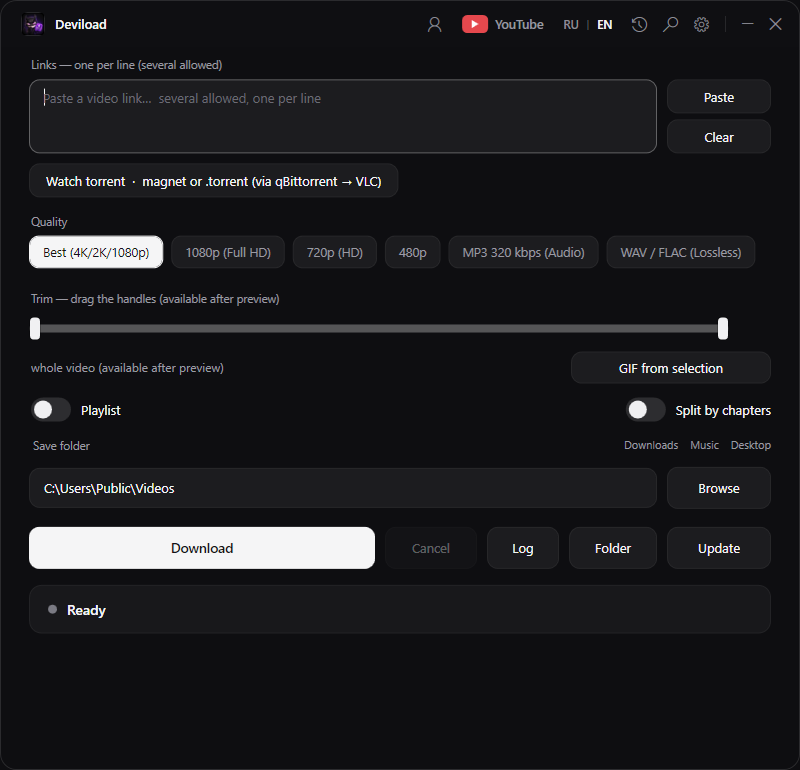
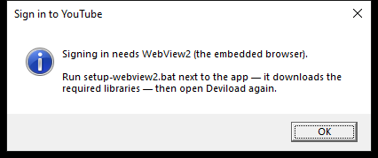
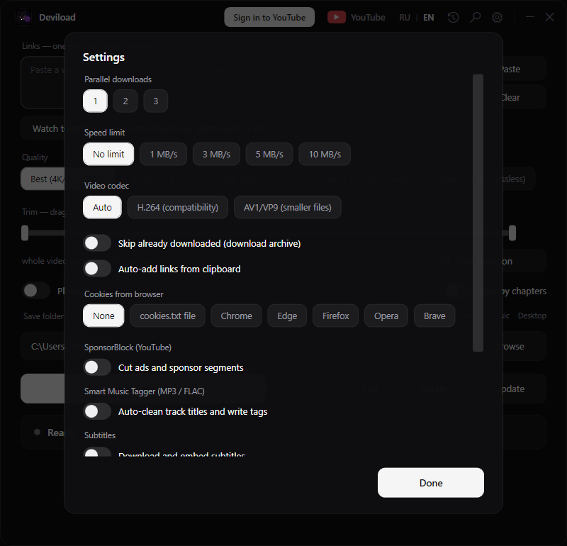

# Deviload — user guide

Deviload is a small Windows front-end for [yt-dlp](https://github.com/yt-dlp/yt-dlp): paste a link, pick a quality, press **Download**. The interface is available in English and Russian (the `RU | EN` switch in the title bar). Russian version of this guide: [guide-ru.md](guide-ru.md).

## Install

1. Download `Deviload-portable.zip` from the Releases page.
2. Unzip it anywhere (for example `C:\Deviload`). The folder must stay together: `Deviload.exe` looks for `yt-dlp.exe`, `ffmpeg.exe` and the other files next to itself.
3. Double-click **Deviload.exe**. Nothing is installed, no admin rights are needed; all settings live in the same folder (`ui-settings.json`, `history.json`).

Windows 10/11 with the WebView2 Runtime (already part of Windows 11 and of every Windows 10 with Edge) is enough. `setup.bat` is only for people who cloned the source repository: it downloads yt-dlp, ffmpeg, deno and the WebView2 libraries that the release zip already contains.

## First download

1. Paste one or more links into the **Links** box (one per line). The Paste button takes the clipboard.
2. Choose the **Quality**: *Best* picks the highest available resolution (4K/2K/1080p); *MP3 320 kbps* and *WAV / FLAC* extract audio only.
3. Pick a **Save folder** (the Downloads / Music / Desktop presets or Browse).
4. Press **Download**. The status line shows the stages (*Preparing… → Downloading → Merging video and audio → Downloaded!*), and a mini player appears when the file is ready.

**Log** opens the yt-dlp output of the last run, **Folder** opens the save folder, **Update** updates yt-dlp itself.

## Sign in to YouTube

### Why

Some videos need a signed-in account: private videos, members-only content, or simply a YouTube that answers "Sign in to confirm you're not a bot" (HTTP 403) after many downloads from one network. Signing in once fixes these. Age-restricted videos also need the sign-in, but since mid-2026 YouTube may additionally ask the account itself to verify its age; if it does, no downloader can get around that — verify the account on youtube.com and try again.

### How

1. Press the **Sign in to YouTube** button in the title bar.
2. A small window with the Google login page opens. Sign in exactly as in a browser (password, two-factor prompt, passkey — everything works, it is a real Microsoft Edge engine).

   

3. As soon as Google redirects to youtube.com, Deviload reads the session cookies, saves them, closes the window and shows *Signed in to YouTube*. The **Cookies** option in Settings switches to *cookies.txt file* automatically.

The button is replaced by an account glyph:

### Where the cookies are stored — and why you must keep them private

- `cookies.txt` next to `Deviload.exe` — the session in the Netscape format that yt-dlp reads with `--cookies`.
- `wv2-profile\` next to `Deviload.exe` — the browser profile of the sign-in window, so you do not have to log in again.

Both files **are your account**. Anyone who has `cookies.txt` can act on YouTube as you until the session expires. Never share them, never attach them to bug reports, never commit them to git. Deviload never sends them anywhere except to YouTube itself through yt-dlp.

### Sign out

Click the account glyph in the title bar and confirm. Deviload deletes `cookies.txt`, wipes `wv2-profile\` and resets the Cookies option to *None*. Signing out of YouTube in your normal browser does not affect Deviload's session and vice versa.

### If the button shows a message about WebView2

The sign-in window needs the three WebView2 libraries (`Microsoft.Web.WebView2.*.dll`, `WebView2Loader.dll`). The release zip contains them; if you run from a source checkout, execute `setup-webview2.bat` once and restart Deviload.

## Playlists and chapters

- **Playlist** toggle: a playlist link downloads every item. The range box accepts `1-10, 15` style ranges.
- **Chapters**: after the preview loads, the *Chapters (N)* button opens a list; tick the chapters you want and each one is saved as a separate file.
- **Split by chapters** toggle: the whole video (or a full-album upload) is cut into one file per chapter/timestamp automatically.
- Several links in the box are downloaded one after another; **Parallel downloads** in Settings runs 2–3 at once.

## Trim and GIF

Paste a link and wait for the preview card. The trim slider under the Quality pills then becomes active: drag the two handles to keep only a part of the video — the label shows *from 0:10 to 1:25*, and the download contains just that range. **GIF from selection** turns the selected range into an animated GIF (480p, saved to the same folder).

## Torrent playback (optional)

**Watch torrent** accepts a magnet link or a `.torrent` file and streams it while it downloads: through qBittorrent (sequential download) into VLC, or through the built-in engine (Node.js, installed by `setup-torrent.bat` on first use) into the WebView2 player. This is an extra; YouTube downloads do not need it.

## Settings

- **Parallel downloads**, **Speed limit**, **Video codec** (H.264 for maximum compatibility, AV1/VP9 for smaller files).
- **Skip already downloaded** keeps a download archive so re-running a playlist skips finished items.
- **Auto-add links from clipboard** pastes every YouTube link you copy.
- **Cookies from browser**: *cookies.txt file* is set for you by the sign-in button; the browser options ask yt-dlp to read a browser's cookie store directly (Firefox works; Chrome/Edge encrypt their cookies on recent Windows builds, so prefer signing in).
- **SponsorBlock** cuts sponsor segments; **Smart Music Tagger** cleans MP3/FLAC titles and writes tags; **Subtitles** downloads and embeds them.
- **Theme** (dark / light) and window transparency.

## Troubleshooting

| Symptom | What to do |
|---|---|
| `HTTP Error 403`, "Sign in to confirm you're not a bot", "This video is private" | Press **Sign in to YouTube** (see above). If you are already signed in and it still fails, sign out and sign in again — the session may have expired. |
| "This content is age-restricted" while signed in | YouTube is asking the account to verify its age. Do that on youtube.com in a normal browser, then sign out and sign in again in Deviload. |
| Status says *Downloaded — cookies are stale* | Same: sign out, sign in again. |
| `ffmpeg not found` / audio and video are not merged | `ffmpeg.exe` and `ffprobe.exe` must sit next to `Deviload.exe`. Re-unzip the release, or run `setup.bat` in a source checkout. |
| Downloads suddenly fail for every video | YouTube changed something; press **Update** to get the newest yt-dlp, then retry. |
| The sign-in button shows a WebView2 message | Run `setup-webview2.bat` (source checkout only), restart. |
| Nothing happens after Download | Open **Log** — the last yt-dlp output explains the reason. |
