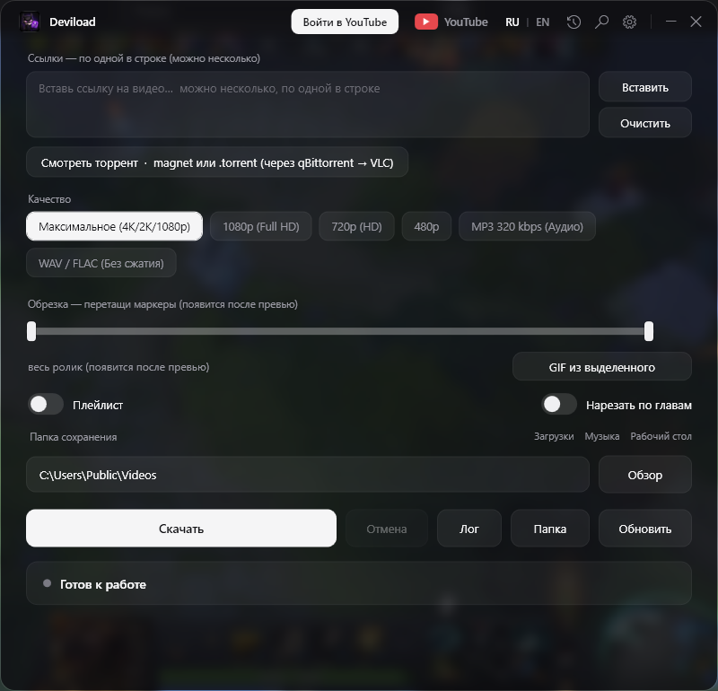
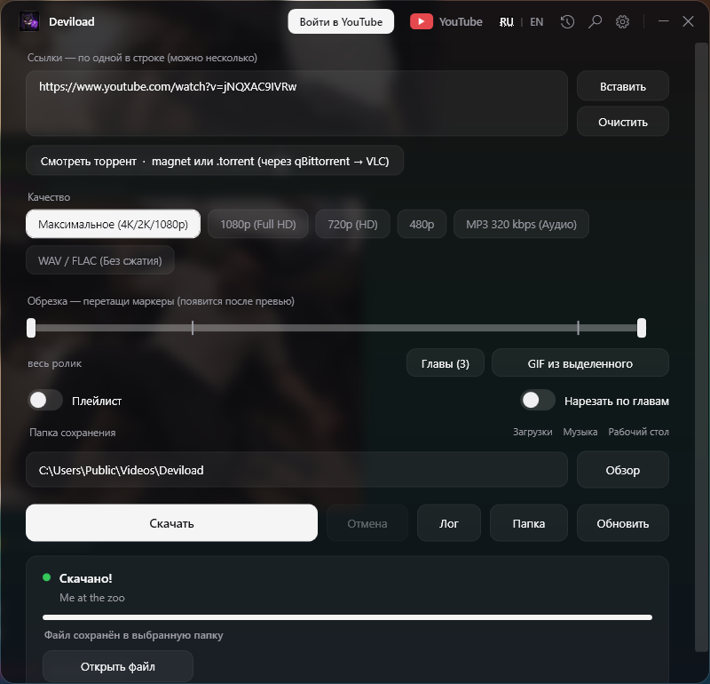
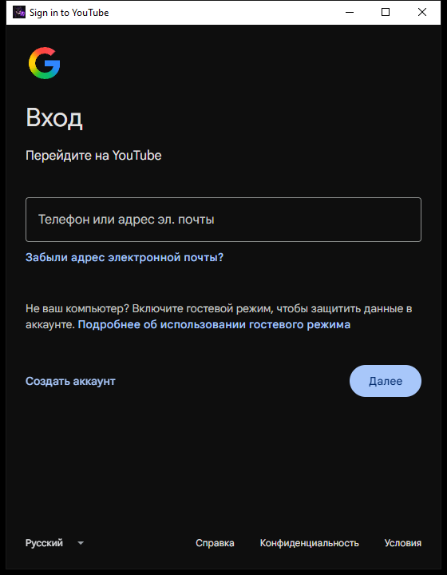
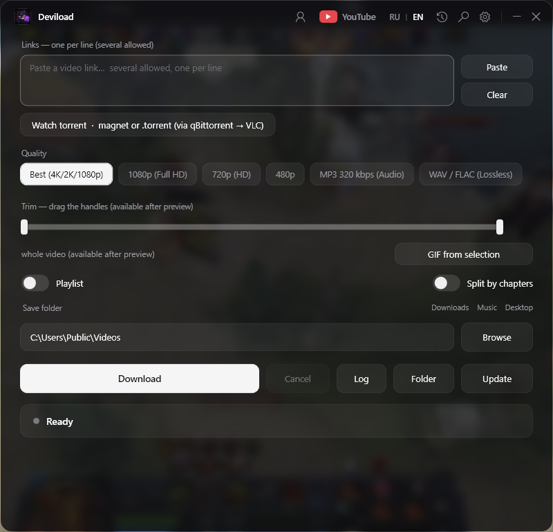
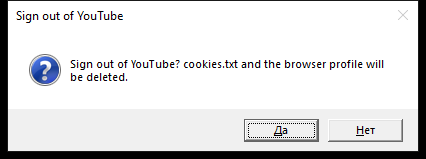
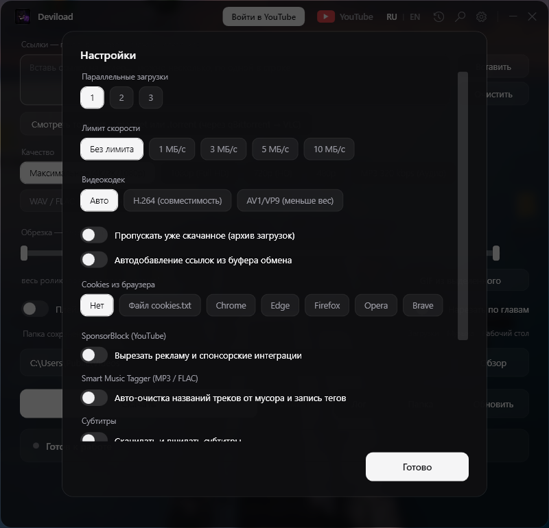

# Deviload — руководство

Deviload — небольшая оболочка для [yt-dlp](https://github.com/yt-dlp/yt-dlp) под Windows: вставил ссылку, выбрал качество, нажал **Скачать**. Интерфейс на русском и английском (переключатель `RU | EN` в заголовке окна). English version: [guide-en.md](guide-en.md).

## Установка

1. Скачайте `Deviload-portable.zip` со страницы Releases.
2. Распакуйте в любую папку (например `C:\Deviload`). Папка должна остаться целой: `Deviload.exe` ищет `yt-dlp.exe`, `ffmpeg.exe` и остальные файлы рядом с собой.
3. Запустите **Deviload.exe**. Ничего не устанавливается, права администратора не нужны; настройки хранятся в той же папке (`ui-settings.json`, `history.json`).

Достаточно Windows 10/11 с WebView2 Runtime (он уже есть в Windows 11 и в любой Windows 10 с Edge). `setup.bat` нужен только тем, кто клонировал репозиторий с исходниками: он скачивает yt-dlp, ffmpeg, deno и библиотеки WebView2, которые в релизном архиве уже лежат.

## Первое скачивание

1. Вставьте одну или несколько ссылок в поле **Ссылки** (по одной в строке). Кнопка «Вставить» берёт ссылку из буфера обмена.
2. Выберите **Качество**: «Максимальное» берёт лучшее доступное разрешение (4K/2K/1080p); «MP3 320 kbps» и «WAV / FLAC» вытаскивают только звук.
3. Укажите **Папку сохранения** (пресеты Загрузки / Музыка / Рабочий стол или «Обзор»).
4. Нажмите **Скачать**. Строка статуса показывает этапы (*Подготовка… → Скачивание → Объединение видео и звука → Скачано!*), а когда файл готов, появляется мини-плеер.

**Лог** открывает вывод yt-dlp за последний запуск, **Папка** — папку сохранения, **Обновить** — обновляет сам yt-dlp.

## Вход в YouTube

### Зачем

Некоторым видео нужен вошедший аккаунт: ролики 18+, приватные видео, контент для спонсоров канала — или просто YouTube, который после множества скачиваний с одной сети отвечает «Sign in to confirm you're not a bot» (HTTP 403). Один вход решает всё это.

### Как

1. Нажмите кнопку **Войти в YouTube** в заголовке окна.
2. Откроется небольшое окно со страницей входа Google. Войдите как в обычном браузере (пароль, двухфакторное подтверждение, passkey — всё работает, внутри настоящий движок Microsoft Edge).

   

3. Как только Google перенаправит на youtube.com, Deviload считает cookies сессии, сохранит их, закроет окно и покажет *Вход в YouTube выполнен*. Пункт **Cookies** в настройках сам переключится на «Файл cookies.txt».

Вместо кнопки появится значок аккаунта:

### Где лежат cookies — и почему их нельзя никому давать

- `cookies.txt` рядом с `Deviload.exe` — сессия в формате Netscape, которую yt-dlp читает через `--cookies`.
- `wv2-profile\` рядом с `Deviload.exe` — профиль браузера окна входа, чтобы не логиниться заново.

Оба файла **и есть ваш аккаунт**. Тот, у кого окажется `cookies.txt`, сможет действовать на YouTube от вашего имени, пока сессия не истечёт. Никому не пересылайте их, не прикладывайте к сообщениям об ошибках, не коммитьте в git. Deviload никуда их не отправляет, кроме самого YouTube через yt-dlp.

### Выход

Нажмите на значок аккаунта в заголовке и подтвердите. Deviload удалит `cookies.txt`, очистит `wv2-profile\` и вернёт пункт Cookies в «Нет». Выход из YouTube в обычном браузере на сессию Deviload не влияет, и наоборот.

### Если кнопка показывает сообщение про WebView2

Окну входа нужны три библиотеки WebView2 (`Microsoft.Web.WebView2.*.dll`, `WebView2Loader.dll`). В релизном архиве они есть; если вы запускаете из исходников, один раз выполните `setup-webview2.bat` и перезапустите Deviload.

## Плейлисты и главы

- Переключатель **Плейлист**: ссылка на плейлист скачивает все его элементы. Поле диапазона понимает записи вида `1-10, 15`.
- **Главы**: после загрузки превью кнопка «Главы (N)» открывает список; отметьте нужные — каждая сохранится отдельным файлом.
- Переключатель **Нарезать по главам**: всё видео (или альбом одним файлом) автоматически режется по главам/таймкодам.
- Несколько ссылок в поле качаются по очереди; **Параллельные загрузки** в настройках запускают 2–3 одновременно.

## Обрезка и GIF

Вставьте ссылку и дождитесь карточки превью. Ползунок обрезки под кнопками качества станет активным: перетащите два маркера, чтобы оставить только часть видео — подпись покажет *с 0:10 до 1:25*, и скачается именно этот кусок. **GIF из выделенного** превращает выбранный отрезок в анимированный GIF (480p, в ту же папку).

## Просмотр торрентов (необязательно)

**Смотреть торрент** принимает magnet-ссылку или файл `.torrent` и проигрывает его по мере скачивания: через qBittorrent (последовательная загрузка) в VLC или через встроенный движок (Node.js, ставится `setup-torrent.bat` при первом использовании) в плеер WebView2. Это дополнение; для скачивания с YouTube оно не нужно.

## Настройки

- **Параллельные загрузки**, **Ограничение скорости**, **Видеокодек** (H.264 — максимальная совместимость, AV1/VP9 — файлы меньше).
- **Пропускать уже скачанное** ведёт архив загрузок: повторный запуск плейлиста пропускает готовые элементы.
- **Автодобавление ссылок из буфера** подхватывает каждую скопированную ссылку YouTube.
- **Cookies из браузера**: «Файл cookies.txt» выставляет кнопка входа; варианты с браузерами просят yt-dlp читать хранилище cookies браузера напрямую (Firefox работает; Chrome/Edge на свежих сборках Windows шифруют cookies, поэтому лучше войти через кнопку).
- **SponsorBlock** вырезает спонсорские вставки; **Smart Music Tagger** чистит названия MP3/FLAC и пишет теги; **Субтитры** скачивает и встраивает их.
- **Тема** (тёмная / светлая) и прозрачность окна.

## Если что-то не так

| Симптом | Что делать |
|---|---|
| `HTTP Error 403`, «Sign in to confirm you're not a bot», «видео приватное / 18+» | Нажмите **Войти в YouTube** (см. выше). Если вход уже выполнен, а ошибка осталась — выйдите и войдите заново: сессия могла истечь. |
| Статус «Скачано — cookies устарели» | То же: выйти и войти заново. |
| `ffmpeg not found` / видео и звук не склеились | `ffmpeg.exe` и `ffprobe.exe` должны лежать рядом с `Deviload.exe`. Распакуйте релиз заново или запустите `setup.bat` в папке с исходниками. |
| Внезапно не качается ни одно видео | YouTube что-то поменял; нажмите **Обновить**, чтобы получить свежий yt-dlp, и повторите. |
| Кнопка входа показывает сообщение про WebView2 | Запустите `setup-webview2.bat` (только для исходников) и перезапустите. |
| После «Скачать» ничего не происходит | Откройте **Лог** — последний вывод yt-dlp объясняет причину. |
